# MyWealthLens — Application Architecture

> Last updated: 2026-05-04

---

## Overview

MyWealthLens is a South African personal finance and wealth-calculator web application. It is a **static-first, serverless** product: the frontend is plain HTML/CSS/JavaScript with no build step, and all dynamic behaviour lives in a small set of Vercel serverless functions. Supabase handles auth and data persistence; PayFast handles recurring payments; Resend handles transactional email.

---

## Technology Stack

| Layer | Technology | Notes |
|---|---|---|
| **Frontend** | HTML5, CSS3, Vanilla JS (ES2020+) | No framework, no bundler — static files served by Vercel CDN |
| **Backend** | Node.js ≥ 18, CommonJS | Vercel Serverless Functions (`api/*.js`) |
| **Auth** | Supabase Auth | Email/password; JWT access tokens |
| **Database** | Supabase PostgreSQL | `subscriptions` table via REST API |
| **Payments** | PayFast | South African recurring billing gateway |
| **Email** | Resend | Transactional email via `noreply@mywealthlens.com` |
| **Hosting / CDN** | Vercel | Static files + serverless functions + cron scheduler |
| **Supabase JS SDK** | `@supabase/supabase-js v2` | Loaded from jsDelivr CDN on every page |

---

## Project Structure

```
wealth-calculator/
├── index.html              # Landing page + sign-up / sign-in modals + payment initiation
├── calculator.html         # Core wealth calculator (gated to Pro subscribers)
├── account.html            # Subscription management (cancel, upgrade, password change)
├── resources.html          # Educational resources
├── privacy-policy.html
├── terms.html
├── vercel.json             # Routing, cron schedule, function config
├── package.json            # Node engine spec only (no runtime deps)
└── api/
    ├── payfast-init.js     # POST — builds signed PayFast subscription form params
    ├── webhook.js          # POST — PayFast ITN handler (activates / cancels subscriptions)
    ├── cancel.js           # POST — cancels active subscription via PayFast REST API
    ├── upgrade.js          # POST — cancels monthly and builds annual upgrade form params
    └── renewal-reminder.js # GET  — daily cron: sends 21-day renewal email via Resend
```

---

## Hosting & Deployment

- **Platform**: Vercel
- **Domain**: `mywealthlens.com`
- **Static assets** are served from Vercel's global CDN
- **Serverless functions** run in the `api/` directory and are exposed at `/api/*`
- **Cron job**: `renewal-reminder` fires daily at `06:00 UTC` (08:00 SAST) via Vercel Cron
- All functions have a `maxDuration` of 10 seconds

---

## User Authentication

Authentication is handled entirely by **Supabase Auth**.

### Sign-up / Sign-in flow
1. User submits email + password via a modal on `index.html`
2. Supabase JS SDK calls `sb.auth.signUp()` or `sb.auth.signInWithPassword()`
3. Supabase returns a session containing a **JWT access token**
4. The token is stored by the Supabase JS SDK in `localStorage` and is available via `sb.auth.getSession()`

### API authorisation
All API calls that require authentication (payfast-init, cancel, upgrade) receive the Supabase access token in the POST body (`access_token` field). The serverless function validates it by calling `GET /auth/v1/user` against Supabase with the token as a Bearer header. If the user cannot be resolved, the function returns `401 Unauthorised`.

### Session management
- `sb.auth.onAuthStateChange()` listens for sign-out / session expiry on the account page
- Password changes (logged-in user) are handled via `sb.auth.updateUser({ password })` on the client
- Password reset (forgot password) uses `sb.auth.resetPasswordForEmail(email, { redirectTo: '.../account.html' })`. Supabase sends the email; emails may land in spam due to default sender domain reputation. For better deliverability, configure custom SMTP in Supabase (e.g. via Resend) — not currently configured.

---

## Subscription Data Model

Supabase `subscriptions` table:

| Column | Type | Description |
|---|---|---|
| `id` | uuid | Primary key |
| `user_id` | uuid | Foreign key → Supabase auth user |
| `plan` | text | `'monthly'` or `'annual'` |
| `status` | text | `'active'`, `'cancelling'`, or `'cancelled'` |
| `payfast_subscription_token` | text | PayFast recurring billing token |
| `next_billing_date` | date | Next charge date |
| `access_until` | date | Grace period end (next billing + 3 days) |
| `reminder_sent_at` | timestamptz | Set when 21-day renewal email is sent |
| `updated_at` | timestamptz | Last modified |

### Subscription status lifecycle

```
[none] → active → cancelling → (ITN CANCELLED) → cancelled
                ↑                                       |
                └── upgrade (monthly → annual) ─────────┘
```

---

## Payment Flow

### New subscription

```
1. User selects plan on index.html
2. Frontend POST /api/payfast-init { plan, access_token }
3. Server validates JWT → checks no active subscription → builds PayFast params + MD5 signature
4. Server returns { pfUrl, params }
5. Frontend injects params into a hidden <form> and submits to https://www.payfast.co.za/eng/process
6. User completes payment on PayFast's hosted page
7. PayFast redirects user to /account.html?welcome=1 (return_url)
8. PayFast sends ITN (Instant Transaction Notification) POST to /api/webhook
9. Webhook verifies merchant_id + payment amount → upserts subscription row (status: active)
```

### Cancellation

```
1. User clicks Cancel on account.html
2. Frontend POST /api/cancel { access_token }
3. Server validates JWT → fetches subscription → calls PayFast REST API PUT /subscriptions/{token}/cancel
4. Server patches Supabase subscription status → 'cancelling'
5. User retains access until access_until date
6. PayFast eventually sends ITN CANCELLED → webhook sets status → 'cancelled'
```

### Upgrade (monthly → annual)

```
1. User clicks Upgrade on account.html
2. Frontend POST /api/upgrade { access_token }
3. Server validates JWT → calls PayFast REST API to cancel monthly subscription
4. Server patches Supabase status → 'cancelling'
5. Server builds new annual PayFast form params + signature
6. Returns { pfUrl, params } — frontend submits form to PayFast
7. User completes annual payment → PayFast ITN → webhook activates annual subscription
```

### Renewal reminder

```
Vercel Cron (daily 06:00 UTC) → GET /api/renewal-reminder
  → Query Supabase: annual + active + next_billing_date = today+21 + reminder_sent_at IS NULL
  → For each match: fetch user email from Supabase Auth admin API
  → POST to Resend API (renewal email)
  → PATCH subscriptions.reminder_sent_at = now()
```

---

## PayFast Integration Details

| Attribute | Value |
|---|---|
| Environment | Production (`www.payfast.co.za`) |
| Form POST signature algorithm | MD5 over **insertion-order** URL-encoded key=value pairs, with `&passphrase=...` appended (spaces encoded as `+`, lowercase hex output) |
| REST API signature algorithm | MD5 over **alphabetical-order** URL-encoded key=value pairs of `merchant-id` + `passphrase` + `timestamp` + `version=v1` |
| Passphrase | **Required** — set in PayFast dashboard (Settings → Integration → Security Passphrase) AND in Vercel env `PF_PASSPHRASE`. Values must be byte-identical. Recurring billing also requires the "Recurring Billing" feature to be enabled on the merchant account. |
| Form payload fields | `merchant_id`, `merchant_key`, `return_url`, `cancel_url`, `notify_url`, `name_first`, `name_last`, `email_address`, `m_payment_id`, `amount`, `item_name`, `custom_str1`, `custom_str2`, `subscription_type`, `frequency`, `cycles` (in that order) |
| Omitted fields | `billing_date` and `recurring_amount` are intentionally NOT sent — PayFast defaults `billing_date` to today and `recurring_amount` to `amount`. Including them was found to cause issues in this integration. |
| `m_payment_id` | Fresh `crypto.randomUUID()` per request (never reused). Supabase `user.id` is passed in `custom_str1` for webhook correlation. |
| Monthly plan | R39.00, frequency `3` (monthly), unlimited cycles |
| Annual plan | R399.00, frequency `6` (annual), unlimited cycles |
| Subscription type | `1` (recurring) |
| ITN endpoint | `https://mywealthlens.com/api/webhook` |
| Self-payment limitation | PayFast's `/eng/process` returns 500 if `email_address` matches the merchant account email. Use a different test email when verifying flows. |

---

## Environment Variables (Vercel)

| Variable | Used in | Purpose |
|---|---|---|
| `SUPABASE_SERVICE_KEY` | All API functions | Service-role key for Supabase REST + Auth admin |
| `PF_MERCHANT_ID` | payfast-init, cancel, upgrade, webhook | PayFast merchant identifier |
| `PF_MERCHANT_KEY` | payfast-init, upgrade | PayFast merchant key (form params) |
| `PF_PASSPHRASE` | All PayFast signing functions | **Required**, byte-identical to the passphrase set in PayFast dashboard. Must be scoped to the project AND included in a fresh deployment (env var changes do not propagate to running functions until redeploy). |
| `RESEND_API_KEY` | renewal-reminder | Resend transactional email API key |
| `CRON_SECRET` | renewal-reminder | Optional — protects cron endpoint from external calls |

---

## Architecture Diagram

```mermaid
graph TD
    subgraph Browser["Browser (Vanilla JS)"]
        UI["HTML Pages\nindex / calculator / account"]
        SB_SDK["Supabase JS SDK v2\n(jsDelivr CDN)"]
        PF_FORM["Hidden PayFast\n<form> POST"]
    end

    subgraph Vercel["Vercel (Hosting + Serverless)"]
        CDN["CDN — Static Files"]
        PF_INIT["POST /api/payfast-init"]
        WEBHOOK["POST /api/webhook"]
        CANCEL["POST /api/cancel"]
        UPGRADE["POST /api/upgrade"]
        CRON["GET /api/renewal-reminder\n(Vercel Cron — daily 06:00 UTC)"]
    end

    subgraph Supabase["Supabase (BaaS)"]
        AUTH["Auth Service\n(email/password + JWT)"]
        DB["PostgreSQL\nsubscriptions table"]
    end

    subgraph PayFast["PayFast (Payments)"]
        PF_HOSTED["Hosted Payment Page"]
        PF_ITN["ITN — Instant\nTransaction Notification"]
        PF_API["REST API\n(cancel subscription)"]
    end

    subgraph Resend["Resend (Email)"]
        EMAIL["Transactional Email\nnoreply@mywealthlens.com"]
    end

    %% Auth flow
    UI -->|signUp / signInWithPassword| SB_SDK
    SB_SDK <-->|JWT session| AUTH

    %% Static delivery
    CDN -->|HTML/CSS/JS| Browser

    %% Payment initiation
    UI -->|POST access_token + plan| PF_INIT
    PF_INIT -->|validate JWT| AUTH
    PF_INIT -->|check existing sub| DB
    PF_INIT -->|signed params| PF_FORM
    PF_FORM -->|form POST| PF_HOSTED

    %% PayFast return + ITN
    PF_HOSTED -->|redirect return_url| UI
    PF_ITN -->|COMPLETE / CANCELLED| WEBHOOK
    WEBHOOK -->|upsert subscription| DB

    %% Cancel
    UI -->|POST access_token| CANCEL
    CANCEL -->|validate JWT| AUTH
    CANCEL -->|fetch sub token| DB
    CANCEL -->|PUT cancel| PF_API
    CANCEL -->|status = cancelling| DB

    %% Upgrade
    UI -->|POST access_token| UPGRADE
    UPGRADE -->|validate JWT| AUTH
    UPGRADE -->|PUT cancel monthly| PF_API
    UPGRADE -->|status = cancelling| DB
    UPGRADE -->|annual params| PF_FORM

    %% Renewal reminder cron
    CRON -->|query annual subs due in 21 days| DB
    CRON -->|fetch email| AUTH
    CRON -->|send renewal email| EMAIL
    CRON -->|mark reminder_sent_at| DB

    %% Account page subscription status
    UI -->|read subscription| DB
```



---

## Key Design Decisions

- **No backend framework** — Vercel's native Node.js serverless runtime is used directly, keeping cold-start times low and dependencies at zero
- **PayFast passphrase is mandatory** — Recurring billing requires a passphrase. The same value lives in the PayFast dashboard and the Vercel `PF_PASSPHRASE` env var; any byte difference (whitespace, case, hidden character) produces a 400 "signature mismatch". Whenever the value changes, both sides must be updated AND a fresh Vercel deploy triggered.
- **Form POST signing uses insertion order, not alphabetical** — Despite some PayFast docs implying alphabetical sorting, the production endpoint validates against the order fields appear in the form. Our `pfSignature()` therefore relies on `Object.keys()` returning insertion order (guaranteed for string keys in modern JS).
- **REST API signing uses alphabetical order** — A different scheme from form POST signing. Header keys (`merchant-id`, `passphrase`, `timestamp`, `version`) are sorted alphabetically.
- **Per-request `m_payment_id`** — A fresh UUID per attempt avoids PayFast's duplicate-payment-id rejection on retries; user identity is preserved via `custom_str1`.
- **Grace period** — `access_until` is set to `next_billing_date + 3 days` at payment time, giving users a buffer if PayFast is slow to process renewal
- **Idempotent webhook** — The webhook uses upsert with `resolution=merge-duplicates`, so duplicate ITN notifications are safe
- **Reminder deduplication** — `reminder_sent_at IS NULL` prevents duplicate renewal emails if the cron fires more than once on the same day
